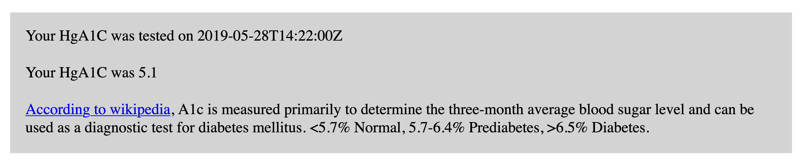

# Epic Patient App Demo 
Patient facing app [demo](https://kuuyyaa.github.io/FHIR-Patient-App/) testing functionality of Epic FHIR APIs. This example uses test data provided by Epic and displays a fake patients HgA1C results as well as the effective date and time. 

## Usage
Deployed demo redirects user to MyChart. When prompted, log in using Epic's test log in. Documentation for Sandbox test data can be viewed [here](https://fhir.epic.com/Documentation?docId=testpatients). For this example, log-in credentials for test patient Camila Lopez can be used.

Once logged in, user is prompted to provide consent to share data. For the purpose of this demo, agree to all prompts. The user will then be redirected to the patient facing app, where the request is displayed (HbA1C in this case!).

